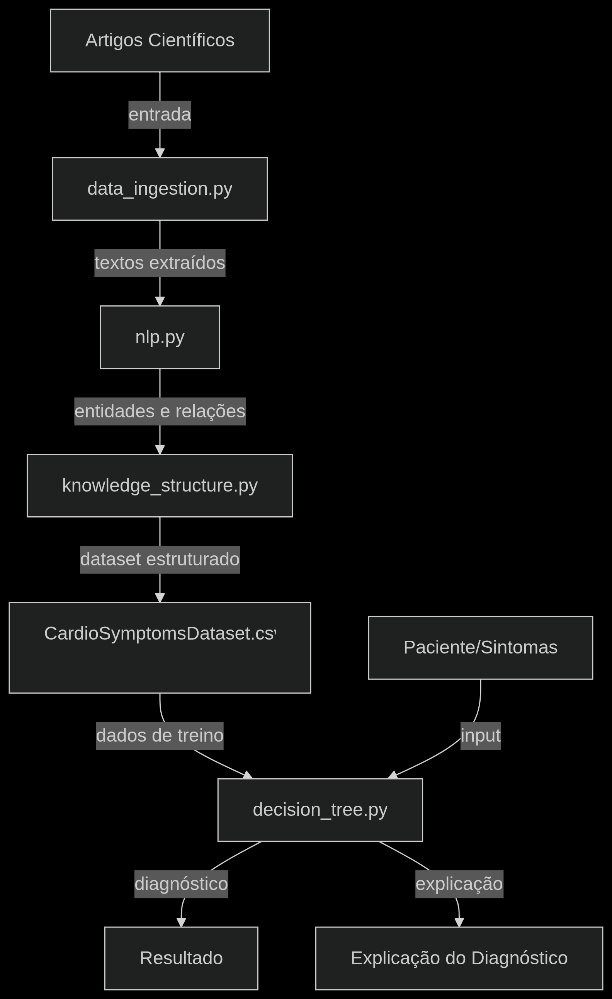

# 🧠 Sistema de Diagnóstico Cardiovascular Assistido por IA

## 📌 Visão Geral
Este projeto implementa um sistema de **extração de conhecimento médico** e **classificação de diagnósticos cardiovasculares** a partir de sintomas relatados.  

Ele combina três pilares:
1. **Ingestão de dados clínicos** (artigos médicos e datasets estruturados).
2. **Processamento de linguagem natural (NLP)** para identificar sintomas, doenças e relações.
3. **Modelo de árvore de decisão** para prever diagnósticos de forma interpretável.  

---

## 👥 Equipe
- **Responsáveis pela arquitetura de IA**:
  - Arthur Fernandes Vieira
  - Guilherme José Araújo de Oliveira
  - Isaque Esdras Rocha da Silva Soares Cavalcanti
  - Jefferson Ribiero Brasil
  - Maria Luiza Galdino Medeiros
  - Rafael Alencar Adelino de Lima

---

## 🏗️ Arquitetura do Projeto

📥 Ingestão de Dados (`data_ingestion.py`)

- Carrega datasets e artigos médicos (ex.: *medBook.txt*).
- Estrutura metadados de artigos para processamento posterior.
- Suporta múltiplas fontes de dados (CSV + texto).

🗣️ Processamento de Linguagem Natural (`nlp.py`)

- Implementado com **spaCy** e `PhraseMatcher`.
- Extrai:
  - **Entidades**: sintomas, doenças, exames.  
  - **Negação**: identifica quando um sintoma/doença foi negado.  
  - **Relações** sintoma-doença com base em pares válidos.  
  - **Informações temporais** e **medições clínicas**.  

**Justificativa:**  
- spaCy escolhido por sua eficiência em NLP biomédico e suporte a expansão futura com modelos como *SciSpacy*.  
- Combina regras + NLP → robustez mesmo sem modelos pesados.

📚 Organização de Conhecimento (`knowledge_structure.py`)

- Classe `KnowledgeOrganizer`:  
  - Estrutura sintomas, doenças, exames, relações e frequências.  
  - Gera tabelas de conhecimento (CSV + JSON).  
  - Cria dataset de treinamento (features binárias).  

**Justificativa:**  
- Separação clara entre **extração de conhecimento** e **modelo preditivo**.  
- Facilita auditoria e interpretabilidade.  

🌳 Modelo de Aprendizado de Máquina (`decision_tree.py`)

- Classe `CardiovascularDiagnosisModel`:  
  - Baseado em **DecisionTreeClassifier (scikit-learn)**.  
  - Pipeline com **SimpleImputer** para lidar com valores ausentes.  
  - Explicabilidade com:
    - Caminho da decisão (`decision_path`).  
    - Importância das features.  
  - Persistência com `joblib`.  

**Justificativas:**  
- **Árvores de decisão** foram escolhidas por:  
  - Alta **explicabilidade** (crucial em contexto médico).  
  - Suporte a variáveis binárias/contínuas.  
  - Robustez contra dados ausentes.  
- Arquiteturas mais complexas (ex.: redes neurais profundas) foram descartadas nesta versão para privilegiar transparência clínica.

---

## 📊 Bases de Dados

1. **`CardioSymptomsDataset.csv`**  
   - Dataset tabular com ~20 sintomas binários (0/1) + coluna alvo `diagnostic`.  
   - Base principal para treinar o modelo de árvore.  

2. **`medBook.txt`**  
   - Corpus textual com descrições clínicas (sintomas → diagnósticos).  
   - Usado para validar a etapa de NLP.  

3. **Datasets externos**  
   - Podem ser incorporados com `update_with_external_dataset()`.  

---

## ⚙️ Pré-Processamento

- Conversão de sintomas em **features binárias** (presente/ausente).  
- Padronização para minúsculas e remoção de ruídos.  
- **SimpleImputer(strategy="most_frequent")** para dados ausentes.  
- Geração de **exemplos positivos e negativos** no `KnowledgeOrganizer`.  

---

## 🖥️ Recursos Computacionais

- **Linguagem:** Python 3.10+  
- **Bibliotecas principais:**  
  - `pandas`, `numpy` → manipulação de dados.  
  - `scikit-learn` → modelo de árvore.  
  - `spaCy` → NLP biomédico.  
  - `joblib` → salvar/carregar modelo.  

- **Hardware:**  
  - CPU suficiente (árvores são leves).  
  - GPU não necessária, mas pode ser usada em versões futuras (transformers biomédicos).  

---

## 📚 Referência Científica

O modelo de árvore de decisão é baseado no trabalho clássico:

> **Breiman, L., Friedman, J., Olshen, R., & Stone, C. (1984).**  
> *Classification and Regression Trees (CART).*  

**Justificativa:**  
- Robusto para dados binários de sintomas.  
- Fácil integração com NLP + ML.  

---

## 🚀 Fluxo do Sistema

